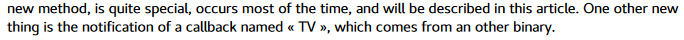
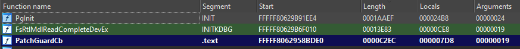
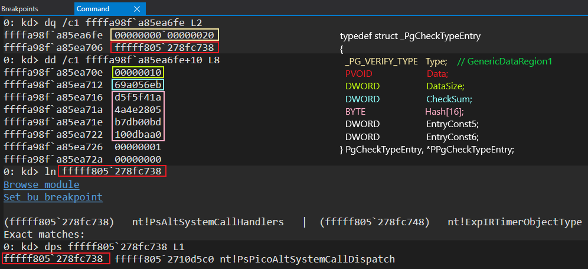

# 542875F90F9B47F497B64BA219CACF69

## Intro

This research is focused only on the functionality of the `PatchGuard` callback (`542875F90F9B47F497B64BA219CACF69`) and how it is triggered. As a side effect we also present some details that apply to other components of `PatchGuard`, because they are needed to understand the functionality of the callback, so don't expect to have all the details of how `PatchGuard` works, what are its components and how they interact.

We tried making everything precise, clear and verifiable but there may be some details that we had to assume/deduce only from static analysis. If you observe any error or have any suggestion, please don't hesitate to contact us (or just submit a pull request). `PatchGuard` is in constant evolution thus take into account that it can differ between kernel versions. We used `Insiders Preview build 19018.vb_release.191101-1402` (`ntoskrnl` SHA256: `08BC2B81D8CD2EF30B6931F6BC1B6CA9CEFE39A61C1C2890169476F43374185A`).

> Everything we present here has been done only for research purposes and understanding, we never intended to find a way to bypass PatchGuard or find vulnerabilities in it.

## Callback creation and Mssecflt.sys

The callback object is created inside `ntoskrnl.exe` - `KiFilterFiberContext` function. To understand how you get there we recommend reading (at least page 9 - 10) [Updated Analysis of PatchGuard on Microsoft Windows 10 RS4](https://blog.tetrane.com/downloads/Tetrane_PatchGuard_Analysis_RS4_v1.01.pdf). We would like to point out that there's, probably an unintended, mistake in page 13 and 14 (below images). The callback object name is part of a `_UNICODE_STRING` structure that is going to be used in `_OBJECT_ATTRIBUTES` definition later passed to `ExCreateCallback`. So the _TV_ string is actually _Length_ and _MaximumLength_ field values inside the `_UNICODE_STRING` structure, the correct name of the callback is `542875F90F9B47F497B64BA219CACF69`.



Searching for references to this callback object we found that `mssecflt.sys` (SHA256: `CF08F7FB7422DC75D6EBD1883402C191F47D122519AF1059BFBCF7BA184B2083`) is the only one registering to be notified. The callback object in `mssecflt.sys` is referenced by `SecInitializeKernelIntegrityCheck` function, which registers a callback function named `SecKernelIntegrityCallback`.
```C
void __fastcall SecKernelIntegrityCallback(
    PVOID CallbackContext,
    NTSTATUS (__fastcall *Argument1)(PMSSEC_PG_CB_ARG1, PMSSEC_PG_CB_ARG2),
    PULONG_PTR Argument2
)
{
  g_pPatchGuardCb = Argument1;
  *Argument2 = (unsigned __int64)&SecProtectedRanges;
}
```
The `Argument1` contains a function pointer (let's abstract it under `g_pPatchGuardCb` as we did in the above snippet) received from `ntoskrnl.exe` and it has 2 call references inside `mssecflt.sys`, functions: `SecKernelIntegrityCheck` and `SecDeferredIntegrityCheck`. To reach `SecDeferredIntegrityCheck` (1) an `APC` is inserted to the current thread inside `SecKernelIntegrityImmediateCheck` as can be seen below.


`SecKernelIntegrityImmediateCheck` is called inside `SecDetPerformImmediateAssertionsImpl` which is an [ExpandedStackCall](https://docs.microsoft.com/en-us/windows-hardware/drivers/ddi/ntddk/nc-ntddk-expand_stack_callout?redirectedfrom=MSDN) routine. The predecessor nodes of the last routine are:

- `SecDetPerformImmediateAssertions`
- `SecObHandleOpenProcessCallbacks`
- `SecGetProcessContextWithAssertions`

We don't walk further on the call tree as it becomes intricate and it's not the focus of this research.

There are 2 other important paths that can reach to `PatchGuard` callback. Both of them start from `DriverEntry` and through `SecCreateDeviceObject` a [DRIVER_DISPATCH](https://docs.microsoft.com/en-us/windows-hardware/drivers/ddi/wdm/nc-wdm-driver_dispatch) routine is registered. The dispatch routine (`SecDeviceOpen`) will handle `IRP_MJ_CREATE`. The paths split inside `SecInitialization`, the first branch (3) ends in `SecDetInitialize` which [allocates a timer](https://docs.microsoft.com/en-us/windows-hardware/drivers/ddi/wdm/nf-wdm-exallocatetimer). Timer's callback routine - `SecDetTimerCallback` - [allocates a work item](https://docs.microsoft.com/en-us/windows-hardware/drivers/ddi/wdm/nf-wdm-ioallocateworkitem) and [enqueues](https://docs.microsoft.com/en-us/windows-hardware/drivers/ddi/wdm/nf-wdm-ioqueueworkitem) it to `BackgroundWorkQueue`. The `WorkerRoutine` is `SecDetTimerPerformDeferredAssertions` which in the end reaches `SecKernelIntegrityCheck`. Second branch (2) ends in `SecCreateCommPorts` which creates a communication port named `\\MicrosoftSecFilterControlPort`. `FltCreateCommunicationPort` registers `SecMessage` as the `MessageNotifyCallback` for this port. When the notification callback is triggered, the execution flow joins the same path as in previous branch - creating a timer, work item and ending in `SecKernelIntegrityCheck`. All this can be seen in a simplified way through this call tree:

1. `APC`
2. `SecInitialization` second branch
3. `SecInitialization` first branch

### Invoking the callback

In order to understand the `PatchGuard` callback let's first understand how it is invoked by `mssecflt.sys`. The callback receives 2 arguments that are pointers to 2 custom structures. The definition of the callback is:
```C
NTSTATUS (__fastcall *)(PMSSEC_PG_CB_ARG1, PMSSEC_PG_CB_ARG2);
```

Both structures are initialized by `mssecflt.sys` before calling the callback. Some of the fields remain unknown to us. The definitions of these structures look like this:

```C
typedef struct _MSSEC_PG_CB_ARG1
{
  DWORD64       SizeOfStruct;
  DWORD64       NtDdiVersion;
  DWORD         Reserved80000h;
  INT           UsePgCtxSize;
  INT64         field_18;
  INT           field_20;
  INT           field_24;
  INT           field_28;
  INT           field_2c;
  DWORD         Option;
  DWORD         Reserved10h;
  PSEC_PG_INFO  SecPgInfo;
} MSSEC_PG_CB_ARG1, *PMSSEC_PG_CB_ARG1;

typedef struct _MSSEC_PG_CB_ARG2
{
  INT   field_0;
  INT   field_4;
  INT64 Counter;
  INT64 field_10;
  INT64 field_18;
  INT64 field_20;
  INT64 field_28;
} MSSEC_PG_CB_ARG2, *PMSSEC_PG_CB_ARG2;

typedef struct _SEC_PROCESSOR_INFO
{
  KAFFINITY ActiveLogicalProcessor;
  USHORT    GroupCounter;
} SEC_PROCESSOR_INFO, *PSEC_PROCESSOR_INFO;

typedef struct _SEC_USERPROBE_INFO
{
  PVOID UserProbeAddress;
  INT64 PtrSize;
} SEC_USERPROBE_INFO, *PSEC_USERPROBE_INFO;

typedef union _SEC_PG_INFO
{
  SEC_PROCESSOR_INFO SecProcessorInfo;
  SEC_USERPROBE_INFO SecUserProbeInfo;
} SEC_PG_INFO, *PSEC_PG_INFO;
```

Here's an example snippet of how the callback is being invoked inside `SecKernelIntegrityCheck`:
```C
  Counter = 0;
  *(_OWORD *)&MsSecPgArg1.UsePgCtxSize = 0ui64;
  *(_OWORD *)&MsSecPgArg2.field_0 = 0i64;
  *(_OWORD *)&MsSecPgArg2.field_10 = 0i64;
  *(_QWORD *)&MsSecPgArg1.field_24 = 0i64;
  MsSecPgArg2.Unknown0 = 0i64;
  MsSecPgArg1.Unknown1 = 0;
  LOBYTE(ntStatus) = KeAreApcsDisabled();
  if ( (_BYTE)ntStatus != 1 )
  {
    MsSecPgArg1.SizeOfStruct = 0x40i64;
    MsSecPgArg1.NtDdiVersion = 0xA000008i64;
    MsSecPgArg1.field_0x80000 = 0x80000;
    MsSecPgArg1.Option = a1_Option;
    MsSecPgArg1.Reserved10h = 0x10;
    MsSecPgArg1.SecPgInfo = a2_SecPgInfo;
    if ( !a2_SecPgInfo )
      MsSecPgArg1.SecPgInfo = a3_SecPgInfo;
    while ( 1 )
    {
      ntStatus = g_pPatchGuardCb(&MsSecPgArg1, &MsSecPgArg2);
      if ( ntStatus != (unsigned int)STATUS_MORE_PROCESSING_REQUIRED )
        break;
      if ( ++Counter > 5 )
        goto call_sec_inc_check_failed_count;
    }
    if ( ntStatus >= 0 )
      return ntStatus;
call_sec_inc_check_failed_count:
    SecIncrementCheckFailedCount();
  }
```

## PatchGuard Callback

Before digging into the callback, it's appropriate to mention that it is one of the biggest functions in the kernel. It is easy to observe that many parts of the callback are inlined functions making the analysis harder and more time consuming, same local variables (memory aliasing) are used in different checks (thus bound to different semantics). A couple of anti-debugging checks are in place, making dynamic analysis harder.
The callback is dependant on other components of `PatchGuard`, mainly the initialization routine which you can easily find after sorting functions by size and picking the biggest (exemplified in the image, all 3 functions are related to `PatchGuard`).


Most of the conditional behavior in the callback is controlled by flags that are set inside `PgInit` (which we didn't analyze), therefore there are some branches that we don't know how they are going to be reached.

Getting into the actual code, execution starts by checking the values of the arguments, status of APCs (disabled or not) and allocate a `NonPagePoolNx` pool with tag `tnIK` and size at least `0xAF0` bytes. The pool is an important component of the callback because it will contain a local copy of what we call `PatchGuard` context structure. The later structure contains the main elements used by `PatchGuard` during checks and is initialized in `PgInit`, its size is `0xAA0` bytes. Some definitions of `PatchGuard` context have been presented by other researchers before, but for convenience we include our own definition (which may contain some newly renamed fields while many of them are still unknown) - [PgCtx](PgCtx.h).

Next two important steps are selecting a session (if [SessionState](PgCtx.h#L305) value is not `-1`) and setting thread affinity group, these are well explained on page 42 - `8 - Setting the Thread Affinity group` in Tetrane's paper, so we're not going to repeat ourselves.

### Types of checks

As already known, the main goal of `PatchGuard` and by extension of this callback is to check the integrity of different system structures/components. To accomplish this task, `PatchGuard` uses different structures whose values are going to be interpreted to determine if there has been any modification in one of the system structures/components. These entries, which we defined as `PgCheckTypeEntry`, can represent one of the types enumerated as [Parameter 4 on CRITICAL_STRUCTURE_CORRUPTION](https://docs.microsoft.com/en-us/windows-hardware/drivers/debugger/bug-check-0x109---critical-structure-corruption). Here you can see a simplified definition of these entries:
```C
typedef struct _PgCheckTypeEntry
{
  _PG_VERIFY_TYPE   Type;
  PVOID             Data;
  DWORD             DataSize;
  DWORD             CheckSum;
  DWORD             EntryConst1;
  DWORD             EntryConst2;
  DWORD             EntryConst3;
  DWORD             EntryConst4;
  DWORD             EntryConst5;
  DWORD             EntryConst6;
} PgCheckTypeEntry, *PPgCheckTypeEntry;
```
It is simplified, because based on our research we found that the fields can be used in different ways, which naturally made us think that this structure is actually an union of different types of entries. Another thing to keep in mind is that some of these entries have additional data after the actual structure (consider it as a header), thus `PatchGuard` needs a way to determine the offset to the next entry in order to iterate all of them. An example of how the callback computes the offset to the next entry based on the entry type can be found in a simple [Python script](pg_entry_dump.py) we developed.
The first `PgCheckTypeEntry` is located in memory immediately after `PgCtx` (whose size is kept in [SizeOfPgCtx](PgCtx.h#L239)), in other words obtaining the first `PgCheckTypeEntry` is resumed to:
```C
PPgCheckTypeEntry pFirstEntry = (PBYTE)PgCtx + PgCtx->SizeOfPgCtx;
```

Next we'll shortly explained how the check for each type is done. 
> `PatchGuard`, for many of the entries, uses a not well-known checksum algorithm, at least we coundn't identify it. A pseudocode implementation of the checksum can be found [here](checksum_algo.md). **From now on we will reference to this as `checksum algorithm`, unless otherwise stated**.

> Also, in every case where there is some corruption found in the system, the code will save the `bugcheck parameters` in the next fields of `PgCtx`:
> - PgCtx->EncodedPointerPgCtxLocal = BugcheckParameter1;
> - PgCtx->EncodedPointerPgCtxEntry = BugcheckParameter2;
> - PgCtx->PgEntryType              = BugcheckParameter3;
> - PgCtx->PgEntryData              = BugcheckParameter4;
>
> **From now on we will reference to this as `bugcheck parameters`**.

> One last remark, is that in every entry after the `bugcheck parameters` have been set, there's a call to a function which is defined as `__b8` in the symbols. We renamed this function to [`__b8_EncryptDecryptEntries`](crypt_decrypt.md), as can be seen in the pseudocode this function depends on bit `0x1e` on the flags set by PgInit, in our research the condition was never met but we skimmed through it statically and we believe is some kind of function to encrypt/decrypt the entries.

#### GenericDataRegion & GenericDataRegion1 & GenericSessionDataRegion

**GenericDataRegion** check starts by computing a checksum over the data that is being pointed by `PgCheckTypeEntry.Data`. If the computed checksum doesn't match with the expected checksum inside `PgCheckTypeEntry.CheckSum` execution continues to check every page which contains the data for this entry and call `VslVerifyPage`. In case the return value from the call is successful (`>= 0`) for all pages the check for this type of entry is finished. Otherwise `PgCtx.pPgFault.XoredChecksum` is used to save the xor result between `PgCheckTypeEntry.CheckSum` and the computed checksum, the `bugcheck parameters` are saved and `encrypt-decrypt entries` routine is called.

**GenericDataRegion1** check is done in an auxilliary function that we named `NTSTATUS __fastcall PgCbHandleGenericDataRegion1(PPgCtx, PPgCheckTypeEntry)`. The first part of the check is identifical as for **GenericDataRegion**. But as an additional check in this function, an special hash of the data will be computed inside `VOID __fastcall ComputeHash(PPgCtx, PVOID, SIZE_T, PVOID)` ([pseudocode](hash_algo.md)) this function will return a 16 bytes buffer that originates from a SHA-256 of the data , which will be checked against the expected value starting at `PgCheckTypeEntry.EntryConst1`. In the following image you can see one **GenericDataRegion1** entry that is going to be checked.


**GenericSessionDataRegion** can be checked in two ways. One of them is using the `checksum algorithm` and the other one is performed when [ChecksStatusFlags](PgCtx.h#L311) `& 4 != 0`. In the later case the check consists of an interation calling `MmIsAddressValid` on each page spanning the data. The check is successful if none of the calls to `MmIsAddressValid` fails.

#### TypeProcessList

In this section we will summarize how all the **TypeProcessList** checks are done (From `Type1ProcessList` to `Type5ProcessList`). All of these checks are quite similar but they differ on which processes list is going to be used for the check. First we will explain how the code determines if there is a misconfiguration then we will mention which list is used for each check. To detect if there's something anomalous, the list of all processes referenced by [PsActiveProcessHead](PgCtx.h#L144) is going to be iterated and set the value of `_EPROCESS.Pcb.Visited` to a value between 1 and 0x80 (it depends on the configuration). [Pcb_Visited_Offset](PgCtx.h#L195) is the offset to the needed field in `_EPROCESS`, while the address of `_EPROCESS` object is obtained by subtracting [ActiveProcessLinksOffset](PgCtx.h#L198) from the list iterator. This first part is going to be used as a reference in order to compare that `_EPROCESS.Pcb.Visited` field contains the previously set value by walking another list that links processes. After each comparison the value of that field is cleared. The lists for each check are:
- Type1ProcessList => [KiProcessListHead](PgCtx.h#L139)
- Type2ProcessList => [PspCidTable](PgCtx.h#L150)
- Type3ProcessList => [HandleTableListHead](PgCtx.h#L160)
- Type4ProcessList => In this case first iteration is over [HandleTableListHead](PgCtx.h#L160) and the second over [PsActiveProcessHead](PgCtx.h#L144)
- Type5ProcessList => No comparisons, just iterate [PsActiveProcessHead](PgCtx.h#L144) and clear the `Visited` field.

We think that `_EPROCESS.Pcb.Visited` is only to be used by `PatchGuard` for these checks. 

#### TypePool

All pool type checks use the `checksum algorithm`. The important thing to note here is that the checksum value is 8 bytes long and it starts at field `PgCheckTypeEntry.EntryConst1`. `PgCheckTypeEntry.Checksum` is unused although it's value can be different than 0. `PgCheckTypeEntry.EntryConst3` is the offset added to `PgCtx` start in order to find the start address of the pool. `PgCheckTypeEntry.EntryConst4` is the size of the pool (in bytes).

Next we have an example of **Type1Pool** entry where the offset to the start of the pool is `0xAA0` (which in this case is `sizeof(PgCtx)`) and added to start of `PgCtx` will sum up to the address of first entry to be checked (as explained [here](README.md#types-of-checks)). The curios property here is `Size` (or `PgCheckTypeEntry.EntryConst4`) which is `0` meaning that nothing is going to be checked. However the checksums are going to match, because the starting value (for the computed checksum) used in `checksum algorithm` is taken from [LoopInitValue](PgCtx.h#L243) which has the same value as the expected checksum.


Other types use the same algorithm.

#### CriticalMSR

For this check, the code will first get the `_GROUP_AFFINITY` of the processor specified in the `PgCheckTypeEntry.EntryConst2` using the call to `KeProcessorGroupAffinity`, with this value they will change the thread to that `_GROUP_AFFINITY`. Once this is done, the code will iterate over the MSRs to be checked, the number of MSRs is defined by `PgCheckTypeEntry.EntryConst1`. In this type the data is after the entry and it contains the following structure for each MSR:
```C
typedef struct _CriticalMSR
{
    QWORD   MsrValueMask;
    QWORD   ExpectedMsrValue;
    DWORD   MsrNumber;
} CriticalMSR, *PCriticalMSR;
```
Having this structure is pretty easy to understand how the check is done. In the normal scenario the value of the MSR will be read with `__readmsr`, this value will be masked with the field `MsrValueMask` and compared against `ExpectedMsrValue` in case they don't match the `bugcheck parameters` will be saved.

An example:


#### ProcessShadow

First, current's process `_EPROCESS` object is obtained using `_KPRCB`, [CurrentThreadOffset](PgCtx.h#L181), [ApcStateProcessOffset](PgCtx.h#L193) and [ApcStateOffset](PgCtx.h#L189). Next `MmCheckProcessShadow` is called and if the return value isn't `0xFFFFFFFF` the `bugcheck parameters` are saved (then expect the bugcheck). An interesting fact is that the return value is also going to be saved to`PgCheckTypeEntry.EntryConst1`. Before saving the parameters, a copy of the current `PgCheckTypeEntry` can be saved to the address pointed by [pPgEntry](PgCtx.h#L343), but this operation depends on the result of [GeneralFlags](PgCtx.h#L310) `& 0x40000000` being true.
When first call to `MmCheckProcessShadow` returns the expected value, execution continues by verifying if [ProcShadowPid](PgCtx.h#L309) isn't 0 and using it in a call to `PsLookupProcessByProcessId`, otherwise using `PsGetNextProcessEx` to obtain a pointer to a new `_EPROCESS` object. Next, `PsAcquireProcessExitSynchronization`, `KeStackAttachProcess`, `MmCheckProcessShadow`, `KeUnstackDetachProcess` and `ObDereferenceProcessHandleTable` are called in a loop that terminates when the count of iterations is greater than `0x100` or the return value is not `0xFFFFFFFF` (expect trouble) or `PsGetNextProcessEx` returns a `NULL`.
Lastly, after successfull execution of the above steps, the return value from `PsGetProcessId` is saved to [ProcShadowPid](PgCtx.h#L309), which makes us think that this field's purpose is to keep state of the last checked process.

#### RetpolineCodePage

`PgCheckTypeEntry.DataSize` has to be non-zero, otherwise the check skips this check entry. Next, depending on the value in [ChecksStatusFlags](PgCtx.h#L311) one of the first 32 bits inside `System` process object is set to 1. The pseudocode explains it better:
```C
if ( PgCtx->ChecksStatusFlags & 0x4000 )
{
  SystemEprocess = PgCtx->SystemEProcess;
  while ( 1 )
  {
    _disable();
    if ( !_interlockedbittestandset(SystemEprocess, (PgCtx->GeneralFlags >> 10) & 0x1F) )
      break;
    _enable();
    _mm_pause();
  }
}
```
In our test environment the clause wasn't satisfied so we couldn't check exactly which bit is going to be set.

If `PgCheckEntryType.EntryConst1`'s least significant bit is 1, the `checksum algorithm` is used on `PgCheckEntryType.Data` with size in `PgCheckEntryType.DataSize` and compare the result to `PgCheckEntryType.Checksum`, as we already learned before.
When that bit isn't set and [SessionObject](PgCtx.h#L308) was initialized (not 0), there are 2 possibilities, already known to us:
- use `checksum algorithm`
- use `MmIsAddressValid`

Which branch/method is chosen is subject to the value in [ChecksStatusFlags](PgCtx.h#L311) and some arithmethic computations like:
```C
v1202 = PgCtx->ChecksStatusFlags
...
if ( !((v1202 ^ (v1202 >> 3)) & 4) )
```
Or 
```C
v1202 = v1203 = PgCtx->ChecksStatusFlags;
v1203 = v1202 ^ (v1202 ^ (8 * v1203)) & 0x20;
PgCtx->ChecksStatusFlags = v1203;
```
when the `MSSEC_PG_CB_ARG2.Field4` is 0.

#### ExecutiveCallbackObject

This check is composed of two phases. First is the familiar `checksum algorithm`. The second phase consists of an iteration over an array of structures. The number of structures to iterate is defined by this relation `PgCheckTypeEntry.DataSize \ 16` where the definition of the structure is:
```C
typedef struct _ExecutiveCbObj
{
  PCALLBACK_OBJECT  CallbackObject;
  PUNICODE_STRING   CallbackName;
} ExecutiveCbObj, *PExecutiveCbObj; 
```
Calling `ExpEnumerateCallback` with the first argument `ExecutiveCbObj.CallbackObject` returns the `CallbackFunction` from [callback registration handle](https://docs.microsoft.com/en-us/windows-hardware/drivers/ddi/wdm/nf-wdm-exregistercallback). The returned pointer (`CallbackFunction`) is then used as an argument to `RtlPcToFileHeader` which allows to obtain the base address of the module where the callback resides. If the last mentioned call fails `PgCheckTypeEntry.EntryConst1` will be assigned the `CallbackFunction` and `PgCheckTypeEntry.EntryConst3` will be assigned the callback registration handle (pointer to the object) before saving the `bugcheck parameters`.


#### ProcessorControlRegister & ExtendedProcessorCR

For both checks first they will get the `_GROUP_AFFINITY` of processor that's specified by `EntryConst6` and set the thread to that group and affinity. At this point is when the checks split, in the case of the **ExtendedProcessorCR** the code will get the `Extended Control Register` using `xgetbv` the value of `XCR0` will be composed and masked with the `_QWORD` starting from `PgCheckTypeEntry.EntryConst1`, this value will be compared agains the expected `XCR0` that was saved in `PgCheckTypeEntry.EntryConst3`. For the case of **ProcessorControlRegister** the control register to check is based on the flag inside `PgCheckTypeEntry.EntryConst5`, if the flag is set then the check will be on CR4 (`__readcr4`) in case is not set the check will be done on CR0 (`__readcr0`), again the value will be masked with the `_QWORD` from `PgCheckTypeEntry.EntryConst1` and compared against the expected Control Register saved in `PgCheckTypeEntry.EntryConst3`. In any case if they expected value doesn't match the `bugcheck parameters` will be populated accordingly.

#### PsWin32Callout

First check if the [Win32CalloutFlag](PgCtx.h#L301) is equal to `0xB` (we didn't find the meaning of this flag/value), if it's equal then get the [Callback Block](https://doxygen.reactos.org/dc/d8d/struct__EX__CALLBACK__ROUTINE__BLOCK.html) object referenced by [PsWin32CallBack](PgCtx.h#L157) with the function `ExReferenceCallBackBlock`, if a `Callback Block` is returned, then the callback function is retrieved using `ExGetCallBackBlockRoutine`. After, if `PgCheckTypeEntry.EntryConst1` (in this case it is a pointer spanning `EntryConst1` and `EntryConst2`) contains the expected function that's referenced by the callback, then they'll be compared. In case `PgCheckTypeEntry.EntryConst1` is NULL, then the code will check that the obtained callback is inside the range defined by [Win32CalloutBlockStart](PgCtx.h#L307) plus [Win32CalloutBlockSize](PgCtx.h#L306), in case this is correct then the obtained callback function will be saved in `PgCheckTypeEntry.EntryConst1`. In any other case the system will bugcheck.

#### SessionConfig

The shortest check, if [ChecksStatusFlags](PgCtx.h#L311) second least significant bit is not set or the call to `RtlIsMultiSessionSku` returns a value different than 0 - expect a bugcheck.

#### ObjectType

For this case `PgCheckTypeEntry.EntryConst1` represents a `_OBJECT_TYPE *` and the high word in `PgCheckTypeEntry.EntryConst3` is the expected value for `ObjectTypeFlags` (here known as `ExpectedTypeFlags`).

The given object is used along with [ObjectTypeTypeInfoOffset](PgCtx.h#L202) and [ObjectTypeTypeFlags](PgCtx.h#L208) offsets to compare the `_OBJECT_TYPE.TypeInfo.ObjectTypeFlags` with the expected one from `ExpectedTypeFlags`. If they aren't equal the bugcheck follows.
Next step is to check if `_OBJECT_TYPE.TypeInfo.SupportsObjectCallbacks` is not set and the object `CallbackList.Flink` is not pointing to itself then it will fail (bugcheck).

This is not the end, `checksum algorithm` is used to check for checksum matching. It is important to mention that after the entry header there's more data to be used in the following check.
The low word of `PgCheckTypeEntry.EntryConst3` is `Length` and `MaximumLength` for a `UNICODE_STRING` structure and the data after the entry header is the `UNICODE_STRING.Buffer`. The initialized structure is going to be used in a call to [ObReferenceObjectByName](https://doxygen.reactos.org/db/d18/obref_8c.html#a727c1f0726c97a4d0f526d541cee1f6a) and the obtained `ObjectPtr` will be compared to `PgCheckTypeEntry.EntryConst1` (the currently checked object). If the comparison is unsatisfied - bugcheck.


#### SystemServiceFunction

In this case, the data is right after the entry header and this data is composed of an array of structures, the number of elements from the array is determined by `0x10 * PgCheckTypeEntry->NextEntryConst2`, and the definition of the structure is as it follows:
```C
typedef struct _SystemServiceFunction 
{
    DWORD   ExpectedChecksum;
    DWORD   DataSize;
    PVOID   Data;
} SystemServiceFunction, *PSystemServiceFunction;
```

With this information the check will iterate over the array and use the `checksum algorithm` this time using `SystemServiceFunction.Data` instead of the `PgCheckTypeEntry.Data`.

#### LoadedModuleList

This check will start by getting a reference to the [PsLoadedModuleList](PgCtx.h#L146), after this the code will get the [RtlpInvertedFunctionTable](PgCtx.h#L174) from which it will obtain the `_INVERTED_FUNCTION_TABLE.CurrentSize` and the pointer to the TableEntry (Array of `_INVERTED_FUNCTION_TABLE_ENTRY`). Then a pool with tag [LoadedModuleTag](PgCtx.h#L241)(`rwPD`) and size `CurrentSize * 8` plus a pseudorandom generated number will be allocated, in this pool they will write what looks like to be random data, except for a certain area where they will save the `DllBase` of the loaded modules by iterating over the `PsLoadedModuleList` (This `_LIST_ENTRY` is the head of the structure [_KLDR_DATA_TABLE_ENTRY](https://www.vergiliusproject.com/kernels/x64/Windows%2010%20%7C%202016/1909%2019H2%20(November%202019%20Update)/_KLDR_DATA_TABLE_ENTRY)) and checking if the `DllBase` is a Session Addres (`MmIsSessionAddress` -> `MiGetSystemRegionType`). This area of the pool will then be sorted with quicksort algorithm (Using a function pointed by the `PgCtx` we called [KeQsort](PgCtx.h#L95)). Lastly to check if everything is fine in the system, the check will iterate over the entries of the inverted table, getting their `_INVERTED_FUNCTION_TABLE_ENTRY.ImageBase` and checking if the previoulsy saved DllBases match any of the ImageBase from the InvertedTable. In case a DllBase from `PsLoadedModuleList` doesn't match any of the ImageBase of the inverted table the system will bugcheck. Here is a little snippet of how this works (Is not complete and some things have been vastly simplified):
```C
while (PsLoadedModuleList != LoadedModules->Flink) {
    DllBase = *(LoadedModules) + DllBaseOffset;
    if (!MmIsSessionAddress(DllBase)) {
        AllocatedPool + i = DllBase;
        i++;
    }
    LoadedModules = LoadedModules->Flink;
}
KeQsort(AllocatedPool);
while (InvertedTableEntries < InvertedTableEntries[CurrentSize]) {
    ImageBase = InvertedTableEntries->ImageBase;
    counter = i - 1;
    while(counter) {
        if (ImageBase == AllocatedPool + j) {
            break;
        }
        counter--;
    }
    if (!counter) {
        KeBugCheck(0x109)
    }
}
```

#### ImportTable & SessionImportTable

First part of the **ImportTable** consists in using the `checksum algorithm` (as in most of the cases over `PgCheckTypeEntry.Data` and length `PgCheckTypeEntry.DataSize`). However there's a small nuance, if `PgCheckTypeEntry.EntryConst1`'s least significant bit is set and the value pointed by [VfThunksExtended](PgCtx.h#L156) is not 0, execution flows into the second phase, otherwise - bugcheck.

Second part of this check is articuled by the call to `VOID __fastcall ComputeHash(PPgCtx, PVOID, SIZE_T, PVOID)` (mentioned before in **GenericDataRegion1**). The output from this call is compared to the expected value hosted by `PgCheckTypeEntry.EntryConst2` (and `PgCheckTypeEntry.EntryConst3`). Here, same nuance applies. If
```C
if ( !(PgCheckTypeEntry->EntryConst1 & 1) || !*PgCtx->VfThunksExtended )
```
is not satisfied, `VslVerifyPage` is called on every page that `PgCheckTypeEntry.Data` extends over. If all of the calls to `VslVerifyPage` return a value `>= 0` the bugcheck is avoided.

An example of an entry:


**SessionImportTable** is not much different, only that it prefixes the above steps with additional checks, that hopefully are better understood in pseudocode than words:
```C
if ( PgCheckType == SessionImportTable )
{
  if ( !PgCtx->SessionObject )
    goto nosessionobject;
  StatusFlags = PgCtx->ChecksStatusFlags;
  if ((PgCtx->ChecksStatusFlags >> 2) & 1)
    goto nosessionobject;
  if ( PgCtx->MsSecArg2Field4 ) // Field4 from MsSecArg2
  {
    if ( (StatusFlags >> 5) & 1 )
      goto nosessionobject;
  }
  else
  {
    PgCtx->ChecksStatusFlags = StatusFlags ^ (StatusFlags ^ (8 * StatusFlags)) & 0x20;
  }
}
```

#### InvertedFunctionTable

The initial step on this check is to execute the already known `checksum algorithm`. On the second step, the [RtlpInvertedFunctionTable](PgCtx.h#L174) will be obtained, and with it the pointer to the TableEntry and the CurrentSize, with these values the inverted function table entries will be iterated comparing the structure against the one pointed by `PgCheckEntryType.Data`, if none of the inverted function table entries matches the one in the `PgCheckEntryType.Data` the system will bugcheck. Finally, another check will be done, this one will again iterate over the inverted function table entries but in this case the check will obtain the ImageBase of the entry and check:
- If the ImageBase is page aligned.
- If the ImageBase address is bigger than the ImageBase + SizeOfImage.
- If the ImageBase address is less than the previous entry ImageBase + SizeOfImage (Entries in the Inverted Function Table are fill when the module is loaded).
- If the ImageBase+SizeOfImage is the same as the previous entry ImageBase + SizeOfImage.

For the last two check the entry has in `PgCheckEntryType.EntryConst3` and `PgCheckEntryType.EntryConst5` the ImageBase and the SizeOfImage of the next entry in the inverted function table.

If any of these checks is not satisfied then the loop will stop and the system will bugcheck (As a side note, both checks are done with IRQL/CR8 == 0xF).

> We strongly recommend reading this [article](http://uninformed.org/index.cgi?v=8&a=2&p=20) to learn more on Inverted Tables. 


#### LoadConfigDirectory

Abstracting some details that aren't critical for understanding the core idea (but important to determine the code path) of this check, it can be sliced in two:
- Use `checksum algorithm` on `PgCheckTypeEntry.Data` and compare the result with `PgCheckTypeEntry.Checksum`
- Depending on the value of `PgCheckTypeEntry.EntryConst5` (third LSb is set), compare `IMAGE_LOAD_CONFIG_DIRECTORY64.GuardCFCheckFunctionPointer` (the pointer to `IMAGE_LOAD_CONFIG_DIRECTORY64` is given in `PgCheckTypeEntry.Data`) with `PgCheckTypeEntry.EntryConst1` ([expected VA where CFG check function pointer is stored](https://docs.microsoft.com/en-us/windows/win32/debug/pe-format#load-configuration-directory)). Next compare `IMAGE_LOAD_CONFIG_DIRECTORY64.GuardCFDispatchFunctionPointer` with `PgCheckTypeEntry.EntryConst3` ([expected VA where CFG dispatch-function pointer is stored](https://docs.microsoft.com/en-us/windows/win32/debug/pe-format#load-configuration-directory)). If compared values aren't matching the system bugchecks.

#### DriverObject

If `PgCheckTypeEntry.DataSize` is 0, which means that this entry contains useful data immediately after the entry header. An `UNICODE_STRING` structure is initialized, `PgCheckEntryType.EntryConst5` represents `UNICODE_STRING.Length` and `UNICODE_STRING.MaximumLength`. `UNICODE_STRING.Buffer` is initialized to the after the entry header (basically `PPgCheckTypeEntry + 1`). This structure is an argument (formal parameter ObjectPath) to `ObReferenceObjectByName` call (where [IoDriverObjectType](PgCtx.h#L142) stands for ObjectType).
Next, calling `RtlLookupFunctionTableEx` with `ObReferenceObjectByName` pointer as first argument and second argument a structure whose second member will the base address of the module containing the function (in this case `Ntoskrnl`). Having the base address of the module, `RtlImageNtHeader` is called to obtain a pointer to `IMAGE_NT_HEADERS` and read `IMAGE_NT_HEADERS.OptionalHeader.SizeOfImage`.
Same steps are repeated but calling `RtlLookupFunctionTableEx` with the pointer from `PgCheckEntryType.EntryConst1`. The end result is `IMAGE_NT_HEADERS.OptionalHeader.SizeOfImage` of the driver.

Next, every entry in the dispatch table of the driver (`DRIVER_OBJECT.MajorFunction[IRP_MJ_MAXIMUM_FUNCTION + 1]`) is checked for membership, in other words if the entry point of the function is not inside `Ntoskrnl`'s address space (for the default case when set to `nt!IopInvalidDeviceRequest`) or not inside driver's address space then a hijack is detected and the system bugchecks (the address of the function that isn't satisfying the constraint is saved to `PgCheckEntryType.EntryConst3`).

Next part of this check is determined by the following check:
```C
if ( !(PgCtx->GeneralFlags & 0x40000000) )
```
If the negation of the conjuction is true, `checksum algorithm` is used on `PgCheckTypeEntry.Data` and the result is saved to `PgCheckTypeEntry.Checksum`. Then using the same algorithm a new checksum is computed on the data from `DRIVER_OBJECT.FastIoDispatch` and size `FAST_IO_DISPATCH.SizeOfFastIoDispatch`, the result is saved to `PgCheckTypeEntry.EntryConst6` (__fast_io_checksum__). No comparisons.
Otherwise, if negation ends as false, the first part (the one checking the address space membership) is performed on `DRIVER_OBJECT.FastIoDispatch` and if successful the above __fast_io_checksum__ computation ends the check. If the any of those `FastIoDispatch` entries failed the test - expect a bugcheck.

#### ProcessorIDT

`PgCheckTypeEntry.EntryConst5` is the processor index used as second argument to `KeProcessorGroupAffinity`, the group affinity is set using `KeSetSystemGroupAffinityThread`. Before proceeding further, the `IDTR` and `GDTR` are saved. At a high level this check is an iteration over contents of the `IDT`, specifically `_KIDTENTRY64` entries.

After entering the loop, the `IRQL` is raised to 0xF. From the current (first) `IDT` entry, the address of the current (first) `ISR` is formed (`_KIDTENTRY64.OffsetHigh << 32 | _KIDTENTRY64.OffsetMiddle << 16 | _KIDTENTRY64.OffsetLow`) - let's name it `IdtIsr`. The address of the `ISR` corresponding to the current iteration (starting from 0) is obtained in this manner `&`[KiIsrThunkShadow](PgCtx.h#L175)`[8 * i]` - let's name it `IsrThunk`. If the `IdtIsr` isn't equal to `IsrThunk` a couple of checks follow. If one of the checks isn't satisfied - the system bugchecks.
At this state a bugcheck can be avoided if these conditions are satisfied:
- [NtosImageBase](PgCtx.h#L279) `< IdtIsr <` [NtosImageEnd](PgCtx.h#L280).
- The call to `RtlSectionTableFromVirtualAddress` ([NtosNtImageHeaders](PgCtx.h#L281) are available to use as first argument) must not fail to return a `PIMAGE_SECTION_HEADER`.
- `PIMAGE_SECTION_HEADER.Characteristics & IMAGE_SCN_MEM_DISCARDABLE` must be 0.
- `_KIDTENTRY64.Selector` must be 0x10 (code segment), `_KIDTENTRY64.Type & 0x1F00` must be 0xE00 (Interrupt Gate) and `_KIDTENTRY64.Present` equal to 1.
- `PRUNTIME_FUNCTION.BeginAddress` (obtained from a call to `RtlLookupFunctionEntry(IdtIst, ..., ...)`) added to `Ntoskrnl` base address must be equal to `IdtIsr`. (*)

(*) An important thing to notice, is that when the last check mentioned above is satisfiable and the execution context/state doesn't have a `KINTERRUPT` initialized (it is 0/NULL), execution increments the loop counter and moves the iterator to next `IDT` entry.

In case there's a `KINTERRUPT` available (**) more checks follow:
- `_KIDTENTRY64.Dpl` must not be 3 (user mode).
- `KINTERRUPT.DispatchAddress` (obtained using [KInterruptDispatchOffset](PgCtx.h#L274)) must be equal to `PRUNTIME_FUNCTION.BeginAddress` (obtained from `RtlLookupFunctionEntry(DispatchAddress, ..., ...)`) added to `Ntoskrnl` base address.
- The call to `RtlSectionTableFromVirtualAddress` must not fail to return a `PIMAGE_SECTION_HEADER`.
- `PIMAGE_SECTION_HEADER.Characteristics & IMAGE_SCN_MEM_DISCARDABLE` must be 0.
- If loop counter is 254 then `KINTERRUPT.ServiceRoutine` (obtained using [KServiceRoutineOffset](PgCtx.h#L275)) must be equal to [HalpPerfInterrupt](PgCtx.h#L277)

Now, when `IdtIsr` is equal to `IsrThunk` first check is to make sure `_KIDTENTRY64.Dpl` is not be 3 (user mode). In order to obtain `KINTERRUPT` structure for the current `ISR`, function `KiGetInterruptObjectAddress` is called (which explains **). After obtaining `KINTERRUPT.DispatchAddress` the next check is if the loop counter is less than 48, and if it is then `IdtIsr` and `DispatchAddress` are saved to the address pointed by [PgFaultArea](PgCtx.h#L158), the bugcheck will follow but not until the iterator is greater that 255 (size of `IDT`).

We reached the end part. Here 2 checksums are calculated (using `checksum algorithm`). First _checksum1_ is calculated for the first 53 entries in the `IDT`. Second _checksum2_ is for entry 225.
If _checksum1_ is not equal to `PgCheckTypeEntry.Checksum` or _checksum2_ is not equal to `PgCheckTypeEntry.EntryConst1` or `IDTR.Size` (saved at the start) is not equal to `PgCheckTypeEntry.EntryConst6` - expect a bugcheck.

The cherry on the cake is summarized in the following snippet:
```C
if ( PgCtx->FeaturesActiveFlags & 1 )
{
  _disable();
  IA32MSR = 0xC0000082i64;      // IA32_LSTAR_MSR
  pKiSyscall64 = __readmsr(0xC0000082);
  __writemsr(0xC0000082, &PgCtx->PgSyscallHook); // 0xC3 -> ret
  if ( !(PgCtx->ChecksStatusFlags & 0x20000) ) // (1)
  {
    Prcb = KeGetCurrentPrcb();
    *PgCtx->qword_FFFFF80629E0F0C0 = &PgCtx + 0xA3A03F5891C8B4E8;
    *PgCtx->qword_FFFFF80629E12DE8 = Prcb;
    *PgCtx->qword_FFFFF80629E12DF0 = 0xC0000082i64;
    Temp = PgCtx->qword_FFFFF80629E12DF8;
    *Temp = 0x112i64;                          // (1)
  }
  KeGuardDispatchICall(&PgCtx->SyscallOpcode1); // 0F 05 -> syscall
  if ( !(PgCtx->ChecksStatusFlags & 0x20000) ) // (2)
  {
    *PgCtx->qword_FFFFF80629E0F0C0 = 0xA3A03F5891C8B4E8ui64;
    *PgCtx->qword_FFFFF80629E12DE8 = 0i64;
    *PgCtx->qword_FFFFF80629E12DF0 = 0i64;
    *PgCtx->qword_FFFFF80629E12DF8 = 0i64;     // (2)
  }
  __writemsr(0xC0000082, pKiSyscall64);
  _enable();
}
```

It is not clear what is the precise purpose of this code, besides the fact that the value of `IA32_LSTAR_MSR` is changed to an address ([PgSyscallHook](PgCtx.h#L257)) inside `PgCtx` that contains opcode `0xC3` and the instruction called is `syscall` ([SyscallOpcode1](PgCtx.h#L259)). We suppose that this can be an attempt to detect MSR syscall hooks, but we're not sure. The fields marked by _(1)_ and _(2)_ left us with the thought that it may be an auxilliary location to save bugcheck parameters in case the `syscall` causes a bugcheck.

#### ProcessorGDT

After setting processor group affinity and thread affinity group (with `KeProcessorGroupAffinity` and `KeSetSystemGroupAffinityThread`), the `IDTR` and `GDTR` are saved. If second LSb in [FeaturesActiveFlags](PgCtx.h#L258) is set, a new `IDT` is initialized for entries with indexes 1, 2 and 0x18. What happens next is way easier to summarize with pseudocode than with words. So...
```C
NewIDT[1] = PgCtx->IdtEntryIdx1;
NewIDT[2] = PgCtx->IdtEntryIdx2;
NewIDT[0x12] = PgCtx->IdtEntryIdx18h;
NewIdtr.Size = 303;
NewIdtr.Base = NewIDT;
NewIDT[1].OffsetLow = &PgCtx->NewIdtDescriptor1;
NewIDT[1].OffsetMiddle = &PgCtx->NewIdtDescriptor1 >> 16;
NewIDT[1].OffsetHigh = &PgCtx->NewIdtDescriptor1 >> 32;
_disable();
__sidt(OriginalIdt);
__lidt(&NewIdtr);
__writedr(7u, 0i64);
NewIDT[1].OffsetLow = &PgCtx->NewIdtDescriptor2;           // unclear why this is done again?
NewIDT[1].OffsetMiddle = &PgCtx->NewIdtDescriptor2 >> 16;
NewIDT[1].OffsetHigh = &PgCtx->NewIdtDescriptor2 >> 32;
if ( PgCtx->FeaturesActiveFlags & 0x20 )
{
  PgCtx->StackSegmentReg = KiGetSs();
  __writedr(0, &PgCtx->StackSegmentReg);
  __writedr(7u, 0x70001ui64);
  PgCtx->pSyscall = KiErrataSkx55Present(&PgCtx->StackSegmentReg);
  __writedr(7u, 0i64);
  __writedr(0, 0i64);
}
else
{
  PgCtx->pSyscall = KiErrata704Present();
}
PgCtx->PrcbNumber = KeGetPcr()->Prcb.Number;
__lidt(OriginalIdt);
_enable();
```

Unregarding of the above case, next important events are reading of `LDTR` and `TR`. Then `checksum algorithm` is used to obtain the checksum over `GDT` and compare it against `PgCheckTypeEntry.CheckSum`, `GDTR.Size` is compared against `PgCheckTypeEntry.EntryConst6`, `LDTR` is compared for equality to 0, `TR` is compared for equality against 64. If any of the above checks are not satisfied the system will bugcheck.

#### ProtectedProcess

This check will iterate over the processes by calling the undocumented function [PsGetNextProcess](PgCtx.h#L98), for each retrieved `_EPROCESS`. The check has different branches but all of the will use the following functions (function names are quite self-explanatory):
- PsGetProcessProtection
- PsGetProcessSignatureLevel
- PsGetProcessSectionBaseAddress

With the values returned from this functions the code will proceed to check the ProcessProtection ([`_PS_PROTECTION`](https://www.vergiliusproject.com/kernels/x64/Windows%2010%20%7C%202016/1909%2019H2%20(November%202019%20Update)/_PS_PROTECTION)), it focuses on two protection levels: 0x72 (`PS_PROTECTED_SYSTEM`) and 0x61 (`PS_PROTECTED_WINTCB_LIGHT`), then if this condition is satisfied they will proceed to compose the SignatureLevel and the SectionSignatureLevel based on the ProcessProtection obtained with `PsGetProcessProtection` and check if this composed value matches the ones obtained from `PsGetProcessSignatureLevel`. In case the `_EPROCESS` is not from System, then the code will call `MmEnumerateAddressSpaceAndReferenceImages` which seems to return some kind of structure with VADs from the process (we are not sure 100% how this functions works, but it seems to iterate over the VadRoot and save values from it into an allocated structure), this returned structure will then be iterated and the SignatureLevel or SectionSignatureLevel (it chooses one or the other based on a check using the previously obtained SectionBaseAddress) will be compared with another computed value from this VAD structure by using `SeCompareSigningLevels`. If something is wrong, this structure will be saved in `PgCheckEntryType.EntryConst3` and the anomalous entry will be saved in `PgCheckEntryType.EntryConst1`.

Is important to mention that this check is only done in the following cases:
- PsGetNextProcess returns NULL, in this case the check is done using the [SystemEProcess](PgCtx.h#L136) and checking for protection level `PS_PROTECTED_SYSTEM`
- When the `_EPROCESS` from PsGetNextProcess is the same one returned by `PsInvokeWin32Callout` with first parameter `0x1A`
- If the returned `_EPROCESS` is a LeaderProcess, check done by `MmIsSessionLeaderProcess`, and is related to SILO processes. The protection level checked is `PS_PROTECTED_WINTCB_LIGHT`

#### ModulePadding

In this check there's two possible ways of checking the data based on how it was initialized. In case `PgCheckEntryType.EntryConst4 == 0` then the check will obtain the data from an array of structures saved just after the entry header, the structure can be defined as it follows:

```C
typedef struct _ModulePaddingData
{
    DWORD   StartOffset;
    DWORD   EndOffset;
    DWORD   Checksum;
} ModulePaddingData, *PModulePaddingData;
```

the pointer where the `StartOffset` is going to be added is contained in `PgCheckEntryType.EntryConst1` and with this data the `checksum algorithm` will be executed. In the other case, where `PgCheckEntryType.EntryConst4 != 0` the array of structures is going to be pointed by `PgCheckEntryType.Data` and the definition of this structure is a bit different 

```C
typedef struct _ModulePaddingData1
{
    DWORD   EndOffset;
    DWORD   StartOffset;
    DWORD   Unknown;     // At least on this verify routine we didn't see this value being used
} ModulePaddingData1, *PModulePaddingData1;
```

The number of entries comes defined by the relation `PgCheckEntryType.EntryConst4 / 0xC` with this information the code will iterate over the entries and again using `PgCheckEntryType.EntryConst1` as the base to add the `StartOffset` it will compute using the `checksum algorithm` but this time just for a byte that will be compared against the expected value that in this case is right after the entry header. Using this latter case to check doesn't mean the first is not going to be done, but in this case to get to the `ModulePaddingData` array the code will compute the offset in the data by using what looks like a magic number division (`0x2AAAAAAAAAAAAAAB`)

#### ImageIntegrity

Execution of this check is dependant on the value of `PgCheckTypeEntry.EntryConst3`. When the second least significat bit of the value is set and [ChecksStatusFlags](PgCtx.h#L311) has the third least significant bit set, first part of the check is an iteration that calls `MmIsAddresValid` on each page containing the data pointed by `PgCheckTypeEntry.Data`. In case none of the previously mentioned bits are set, `checksum algorithm` is used and the target value is in `PgCheckTypeEntry.Checksum`. These are to be considered part one.

In order to continue into part two, LSb of `PgCheckTypeEntry.EntryConst3` must be set, otherwhise this check is done. In continuation, `PgCheckTypeEntry.EntryConst1` represents the base address of the image to check and `RtlImageNtHeader` function is used to obtain a pointer to `IMAGE_NT_HEADERS` to which `IMAGE_NT_HEADERS.SizeOfOptionalHeader` is added to reach the first `IMAGE_SECTION_HEADER`. Starting from first section header a couple of checks are done (by order of occurence):
- `(IMAGE_NT_HEADERS.VirtualAddress + max(IMAGE_NT_HEADERS.VirtualSize, IMAGE_NT_HEADERS.SizeOfRawData)) & 0xFFFFF000` is computed in order to get the next section virtual address (RVA), in case the computed virtual address is `<= 0x1000` (usual RVA of the first section ) section iterator is incremented (moved) top the next section. If the check was done on the last section then iteration stops (and the whole check is done).
- Sections with `IMAGE_NT_HEADERS.Characteristics` having `IMAGE_SCN_MEM_DISCARDABLE` are ignored.
- Sections with `IMAGE_NT_HEADERS.Name` in this list (`[INITKDBG, PAGEwx, PAGEww, PAGEwr, ERRATA, PAGEVRF, PAGESPEC, INIT, PAGEKD]`) are ignored. As a side note, last 4 members are pointed by [PAGEVRF](PgCtx.h#L295), [PAGESPEC](PgCtx.h#L296), [INIT](PgCtx.h#L297), [PAGEKD](PgCtx.h#L298).
- Sections with `IMAGE_NT_HEADERS.Characteristics` having `IMAGE_SCN_MEM_WRITE` or not having `IMAGE_SCN_MEM_EXECUTE` are ignored.

If execution passes all required checks, next steps are orchestrated by the third LSb in [FeaturesActiveFlags](PgCtx.h#L258). Let's dissect first part, when that bit is set.

All squares in the image are BBs (basic blocks). _BB1_ checks for the bit mentioned above. _BB2_ initializes _ECX_ to the value that signifies `XBEGIN_STARTED`, then `xbegin` is executed with the fallback address being the start of next BB. In _BB3_ if _EAX_ (which contains RTM status) is not equal to `XBEGIN_STARTED` this means that there was an RTM abort and execution will continue in _BB5_, otherwise to _BB4_ which fetches a byte from the section data and executes `xend`, in case the transaction fails execution will end in _BB3_ as it is memorized as the fallback address, otherwise it will continue to _BB6_ - an incrementation block. Inside _BB5_ depending on the result of the check a new attempt to access the section data is going to be performed using a different method (starting in _BB7_).
The different method branches, too. Second branch is taken when the base address of the image to verify is [NtImageBase](PgCtx.h#L169) or [HalImageBase](PgCtx.h#L170) and the section name is not starting with `.eda` or `EGAP` (is it a mistake? did they meant `PAGE`?). An [MDL](https://docs.microsoft.com/en-us/windows-hardware/drivers/kernel/using-mdls) is initialized and then [MmGetPhysicalAddress](PgCtx.h#L119) is called. First branch is taken in other cases, and it consists of a call to the function that we named [InitProbeAndLockMdl](PgCtx.h#L118).
The prototype of the function can be defined as:
```C
NTSTATUS __fastcall PgCb_InitProbeAndLockMdl(PMDL Mdl, PVOID ImgBaseAddress)
```
If the return status is `STATUS_ACCESS_VIOLATION` and `PgCheckTypeEntry.EntryConst3 & 4` is 0 then the system bugchecks. This last check involves an additional check (in case `EntryConst3 & 4` isn't 0) for section characteristics having `IMAGE_SCN_MEM_WRITE` that leads to the bucheck, too. (Clear thing the last sentence contradicts in one case with what we said above, but not to make our explanation "spaghetti" we leave this corner case unexplained).

After any of the above two branches (part of the second method) is executed, an _barrier_ is initialized with a call to `RtlInitMinimalBarrier(&`[MinimalBarrier](PgCtx.h#L335), *[KeNumberProcessors_0](PgCtx.h#L171)`)`. Next is a call to `KeIpiGenericCall(&PgCtx + `[OffsetIpiTargetCall](PgCtx.h#L236)`)`. We tried to get the code that is going to be executed, but the results were evidently wrong, probably the offset we had was wrong or we commited another mistake.

When all the sections are verified the check is done.

#### FunctionOrPdata & FunctionOrPdata1 & SessionFunctionOrPdata

We will analyze this three checks together since they are quite similar, first **SessionFunctionOrPdata** will check if there is a [SessionObject](PgCtx.h#L308) in case there is no the check will jump into the general check, if there is a session object, the page aligned data will be obtained from `PgCheckEntryType.Data` and passed as an argument to `MmIsAddressValid` in case this function fails the system will bugcheck, if it doesn't fail then the `checksum algorithm` will be applied with the `PgCheckEntryType.Data` and `PgCheckEntryType.DataSize`. 

For cases **FunctionOrPdata** and **FunctionOrPdata1**, both will start by first doing the already known `checksum algoritm` if everything is correct, then the paths will split. We will first focus on the **FunctionOrPdata** which is a bit more simple. For this check, the `PgCheckEntryType.Data` points to an array of structures that have the following definition:
```C
typedef struct _FunctionOrPdata
{   
    DWORD   StartFunctionOrPdata;
    DWORD   EndFunctionOrPdata;
    DWORD   Unknown;
} FunctionOrPdata, *PFunctionOrPdata;
```
with this structure and taking into account that the base address of the module where the function or data is located is in the field `PgCheckEntryType.EntryConst3`, the code will iterate each entry of the array and use the `checksum algorithm` to prove if the expected checksum is obtained, this expected checksums are saved in order after the entry header. 

For **FunctionOrPdata1**, the check will be mostly handled on an auxiliary function we called `int __fastcall PgCbHandleFunctionOrPdata1(PPgCtx PgCtx, PVOID FunctionOrData, unsigned int FunctionOrDataSize)`. This function, will first obtain a pointer to the `FunctionOrData - 0x6`. With this pointer the code will check if the 6 bytes before the `FunctionOrData` match the following pattern: `4C 87 00 98 C3 [90|F1]`. If the pattern doesn't match then they will use 0 as the key value to calculate the hash, in case the pattern condition is satisfied then the function will call `__int64 __fastcall KiAccessPage(__int64 (__fastcall *Pattern)(), PVOID pFunctionOrPdata, _QWORD FunctionOrPdata)` this function is quite small, and inlining the `Pattern` it will look something like this:

```asm
48 83 EC 28             sub    rsp, 0x28
48 8b C2                mov    rax, rdx
FF D1                   call   rcx
    4C 87 00                xchg qword ptr [rax], r8
    98                      cwde
    C3                      ret
    90                      nop
49 83 C9 FF             or     r9, 0xffffffffffffffff
48 92                   xchg   rdx, rax
98                      cwde
48 3B C2                cmp    rax, rdx
49 8B C1                mov    rax, r9
49 0F 44 C0             cmovz  rax, r8
48 83 C4 28             add    rsp, 0x28
C3                      ret
```

This snippet will basically return the first 8 bytes from the function or pdata, and in this case this value is the one that's going to be used as the key to calculate the checksum that will be returned from `PgCbHandleFunctionOrPdata1`. Before comparing this checksum agains the expected value (As in **FunctionOrPdata** the expected checksum is after the entry header) the check will again test if the `FunctionOrPdata - 0x6` match the pattern and in case it does it will compose a new idt decriptor for `INT 01`, modify the `IDTR`, write `0xF1` in the `FunctionOrPdata - 0x1` and call the function `KeDispatchCall(pFunctionOrPdataMinusOne)`. Since `OxF1 == icebp` which triggers an `INT 01`, the trap will be handle by the new `ISR`. This can be seen in the following pseudocode (similar to IDT and GDT case):

```C
NewIdtBase[1]  = PgCtx->IdtEntryIdx1;
NewIdtBase[2]  = PgCtx->IdtEntryIdx2;
NewIdtBase[18] = PgCtx->IdtEntryIdx18h;
NewIdtr.Size = 303;
NewIdtr.Base = NewIdtBase;
NewIdtBase[1].OffsetLow    = &PgCtx->IdtEntryIdx1Offset;
NewIdtBase[1].OffsetMiddle = &PgCtx->IdtEntryIdx1Offset >> 16;
NewIdtBase[1].OffsetHigh   = &PgCtx->IdtEntryIdx1Offset >> 32;
__sidt(Idtr);
__lidt(&NewIdtr);
*(ptrFuncOrPdata - 1) = 0xF1;
if ( !(PgCtx->ChecksStatusFlags & 0x20000) )
{
  Prcb = KeGetCurrentPrcb();
  *PgCtx->qword_FFFFF80629E0F0C0 = PgCtx + 0xA3A03F5891C8B4E8ui64:
  *PgCtx->qword_FFFFF80629E12DE8 = Prcb;
  *PgCtx->qword_FFFFF80629E12DF0 = ptrFuncOrPdata;
  *PgCtx->qword_FFFFF80629E12DF8 = 0x113i64;
}
KeGuardDispatchICall(ptrFuncOrPdata);
if ( !(PgCtx->ChecksStatusFlags & 0x20000) )
{
  *PgCtx->qword_FFFFF80629E0F0C0 = 0xA3A03F5891C8B4E8ui64;
  *PgCtx->qword_FFFFF80629E12DE8 = 0i64;
  *PgCtx->qword_FFFFF80629E12DF0 = 0i64;
  *PgCtx->qword_FFFFF80629E12DF8 = 0i64;
}
```

Finally, for both **FunctionOrPdata** and **FunctionOrPdata1** if everything went right until this point there's one last check this time using the `RtlpInvertedFunctionTable`. For this check, the inverted function table entries will be iterated comparing them with the value pointed by `PgCheckEntryType.EntryConst1`, if all of the entries of the inverted function table are check and no one matches then the system will bugcheck (Similar to the InvertedFunctionTable case).

#### LocalAPIC

`PgCheckTypeEntry.EntryConst5` is the processor index used as second argument to `KeProcessorGroupAffinity`, the group affinity is set using `KeSetSystemGroupAffinityThread`. If [LocalAPICRelated](PgCtx.h#L327) is available the value of `IA32_X2APIC_LVT_TIMER` MSR is read from [LocalAPICRelated](PgCtx.h#L327)`[200]` otherwise `__readmsr(0x832)` is in charge. As before is proceeded for `IA32_X2APIC_LVT_PMI`. Group affinity is restored by calling `KeRevertToUserGroupAffinityThread` and we're for the next part.

If [FeaturesActiveFlags](PgCtx.h#L258) has fifth LSb set, a new `IDT` is initialized for entries with indexes 1, 2 and 0x18. The original `IDTR` is saved then the new one is loaded. In between two conditional blocks a call to `KiErrata361Present()` is squeezed. As in other similar cases an example of pseudocode makes it easier to comprehend:
```C
_disable();
pNewIdt[1] = PgCtx->IdtEntryIdx1;
pNewIdt[2] = PgCtx->IdtEntryIdx2;
pNewIdt[0x12] = PgCtx->IdtEntryIdx18h;
NewIdtr.Size = 303;
NewIdtr.Base = pNewIdt;
pNewIdt[1].OffsetLow = &PgCtx->NewIdtDescriptor1;
pNewIdt[1].OffsetMiddle = &PgCtx->NewIdtDescriptor1 >> 16;
pNewIdt[1].OffsetHigh = &PgCtx->NewIdtDescriptor1 >> 32;
__sidt(OriginalIdtr);
__lidt(&NewIdtr);
if ( !(PgCtx->ChecksStatusFlags & 0x20000) )
{
  CurrentPcrb = KeGetCurrentPrcb();
  *PgCtx->qword_FFFFF80629E0F0C0 = &PgCtx + A3A03F5891C8B4E8h;
  *PgCtx->qword_FFFFF80629E12DE8 = CurrentPcrb;
  *PgCtx->qword_FFFFF80629E12DF0 = 0i64;
  *PgCtx->qword_FFFFF80629E12DF8 = 0x115i64;
}
KiErrata361Present();
if ( !(PgCtx->ChecksStatusFlags & 0x20000) )
{
  *PgCtx->qword_FFFFF80629E0F0C0 = 0xA3A03F5891C8B4E8ui64;
  *PgCtx->qword_FFFFF80629E12DE8 = 0i64;
  *PgCtx->qword_FFFFF80629E12DF0 = 0i64;
  *PgCtx->qword_FFFFF80629E12DF8 = 0i64;
}
__lidt(OriginalIdtr);
_enable();
```

The disassembled code located at [NewIdtDescriptor1](PgCtx.h#L256) is:
```asm
48 CF              iretq
```
And the code of `KiErrata361Present` is (left some pointers to a future us/me):
```asm
000 8C D0                   mov     eax, ss
000 9C                      pushfq
008 81 0C 24 00 01 00 00    or      dword ptr [rsp], 100h        // TF set
008 9D                      popfq
000 8E D0                   mov     ss, eax                      // read "Intel Manual: Interrupt 1 Debug Exception.Program State Change"
000 F1                      icebp                                // doesn't modify TF: http://www.rcollins.org/secrets/opcodes/ICEBP.html
000 9C                      pushfq
008 81 24 24 FF FE FF FF    and     dword ptr [rsp], 0FFFFFEFFh  // clear TF
008 9D                      popfq
000 C3                      retn
```

Next, if any of the following clauses aren't satisfied, the system bugchecks.
```C
ExpectedLapicValue = PgCheckTypeEntry->EntryConst1;
if ( (LapicLvtTimerValue & PgCheckTypeEntry->EntryConst2) != ExpectedLapicValue
  || !_bittest(&LapicLvtTimerValue, 0x10u) && LapicLvtTimerValue != 0xD1 && (LapicLvtTimerValue + 3) > i )
```
```C
ExpectedPmiValue = PgCheckTypeEntry->EntryConst3;
if ( (LapicPmiValue & PgCheckTypeEntry->EntryConst4) != ExpectedPmiValue
  || !_bittest(&LapicPmiValue, 0x10u) && LapicPmiValue != 0xD1 && (LapicPmiValue + 3) > i )
```

#### PageHashMismatch

For this check the callback will use another auxiliary function which we renamed as `VOID __fastcall PgCbHandlePageHasMismatch(PPgCtx PgCtx, PPgCheckTypeEntry PgCheckTypeEntry)`. This function will first obtain a pointer to data after the entry header which will contain an array of structures with the precomputed hashes, this structure has the following definition:

```C
typedef struct _PageHashMismatchEntry 
{
    BYTE    ModifiedSha256[0x10];
    DWORD   CrcHash;
} PageHashMismatchEntry, *PPageHashMismatchEntry
```
On the other hand, from `PgCheckEntryType.EntryConst3` the function will obtain the ImageBase of the module to check and from `PgCheckEntryType.EntryConst5` the size of it. With this information the check will proceed to compute a pseudorandom number which will act as the index for the array and also the offset that's going to be added to the ImageBase, with this it will execute the `checksum algorithm` and see if the one calculated from that offset in the ImageBase matches the corresponding with the `PageHashMismatchEntry.CrcHash` for that index. If the check succeed, then it will proceed to compute the Modified SHA256 with the function `ComputeHash`, passing as the data to hash the `ImageBase+Offset` and as the size one page (`0x1000`, the digest is going to be checked against `PageHashMismatchEntry.ModifiedSha256`.

If everything is fine then the function will proceed with another check, this next check is based on the inverted function table, and is very similar to the other cases where we explained this. From `PgCheckEntryType.EntryConst1` the function will obtain a `INVERTED_FUNCTION_TABLE_ENTRY`, and it will iterate over the entries in the `INVERTED_FUNCTION_TABLE RtlpInvertedFunctionTable`, if none of them matches the one from `PgCheckEntryType.EntryConst1` then the system will bugcheck.

There's one last case, which will proceed almost the same as the one explained above, with the CRC and the modified SHA256 but this time some data will be saved (PageBase, SizeOfPage, ModifiedSha256) in an array of structures which is pointed by [PageHashMismatchRelated](PgCtx.h#L344) also in this case the Modified Sha256 is calculated and saved in the structure in a function we named `PgComputeParallelSha256Derivation`


#### Rest of Type Checks

During the research we notice that some of the checks were always ending in the same piece of code, this code just check if something is wrong ([SomethingWentWrong](PgCtx.h#L286) `!= 0`) and if it's the case it Bugchecks. It seems that this types won't be checked on this callback (Probably they are verified on another `PatchGuard` verify routine). The list of types that end up here is the following:
- DebugRoutine
- ProcessorIVT
- DebugSwitchRoutine
- IRPAllocator
- DriverCallDispatcher
- IRPCompletionDispatcher
- IRPDeallocator
- CriticalFloatingPointCR
- SessionPageHashMismatch
- GeneralPool
- Win32k
- ProcessorMisconfiguration


### Ending notes

Did we explain everything? No! Of course some details were left over and some details may be incomplete (we hope not incorrect). Please keep in mind that only this callback is decompiled to more than 9k lines of pseudocode (which of course helps a lot), which are hard to debug or in some cases impossible (mostly because some entry types are missing).

Also, we are still missing one (quite long) check, KernelNotificationCallout. We will update the README with this check soon :)

We are open to discuss more, hear any suggestions or corrections. Please don't hesitate to contact us!

### Acknowledgements

- HexRays team for IDA Pro and its decompiler.
- Satoshi Tanda [Some Tips to Analyze PatchGuard](http://standa-note.blogspot.com/2015/10/some-tips-to-analyze-patchguard.html)
- Tetrane [Updated Analysis of PatchGuard on Microsoft Windows 10 RS4](https://blog.tetrane.com/2019/Analysis-Windows-PatchGuard.html)
- [ReactOS](https://doxygen.reactos.org/)
- [Vergilius Project](https://www.vergiliusproject.com/)
- Microsoft PatchGuard team for developing a nice piece of engineering.

With love from [@n4r1b](https://twitter.com/n4r1b) & [@0xcpu](https://twitter.com/0xcpu) .
