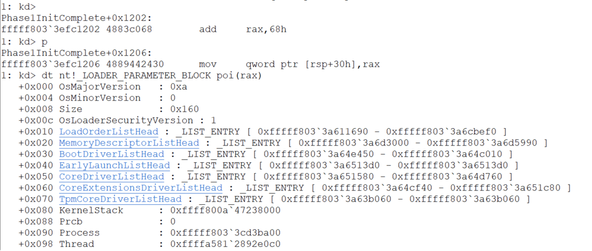

## Phase1InitComplete

Initial investigation show that this callback is only notified one time (Phase1 only happens one time so this makes total sense). The function `ExNotifyCallback` for this callback object is called inside `Phase1InitializationIoReady`. As seen on the MSDN the prototype for [`ExNotifyCallback`](https://docs.microsoft.com/en-us/windows-hardware/drivers/ddi/content/wdm/nf-wdm-exnotifycallback) is the following:

```C
void ExNotifyCallback(
  PVOID CallbackObject,
  PVOID Argument1,
  PVOID Argument2
);
```

With the help of IDA we can see that this function is called with the following parameters:


The variable `ExCbPhase1InitComplete` holds the pointer to the `CALLBACK_OBJECT`. And the `Argument1` and `Argument2` are zero, this means that our callback won't receive any interesting arguments.

### Remarks
For this driver to work, it must be loaded at Boot time that means that the `StartType` of this services must be set to `SERVICE_BOOT_START`. Also, for the bootloader to load the driver this must be in the folder `%SYSTEMROOT%\System32\drivers\`

Having this in mind, the use case of this is quite small. But just for fun, we decided to add some code in the callback that allow us to retreive the address of the `LOADER_PARAMETER_BLOCK`. To do this, we basically obtain the address of the return address (Using the intrinsic [_AddressOfReturnAddress](https://docs.microsoft.com/en-us/cpp/intrinsics/addressofreturnaddress?view=vs-2019)) we checked using IDA and WinDbg how much we need to add to this value in order to obtain the pointer to the `LOADER_PARAMETER_BLOCK`. To make this short, the callback gets called from `ExNotifyWithProcessing` which substracts 0x30 to `rsp` (We add 0x8 for the retn addr from this function) this comes from `ExNotifyCallback` which substracts 0x28 (Again we add 0x8 for the retn addr) finally we found out the next value (At least on In Windows 10 ver 1903 (OS Build 19002.1002)) in the stack corresponds with the `LOADER_PARAMETER_BLOCK` (This is inside `Phase1InitializationIoReady`) so in the end would be:
`0x30 + 0x8 + 0x28 + 0x8 = 0x68`. In the following image it can be seen how the code is adding 0x68 to `rax` and then we can use this value (pointer) to dispay the type `LOADER_PARAMETER_BLOCK`:


