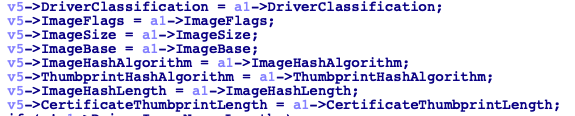

## WdEbNotificationCallback

The main function of this callback is to notify `WdFilter` when a `KnonwBadImage` has tried to be loaded. Of course, this callback is notified from within `WdBoot` (Windows Defender ELAM driver), more specifically from the [`BOOT_DRIVER_CALLBACK_FUNCTION`](https://docs.microsoft.com/en-us/windows-hardware/drivers/ddi/ntddk/nc-ntddk-boot_driver_callback_function) of this driver.

To trigger this callback the parameter [`BDCB_CALLBACK_TYPE`](https://docs.microsoft.com/en-us/windows-hardware/drivers/ddi/ntddk/ne-ntddk-_bdcb_callback_type) must be set to `BdCbStatusUpdate` (A status update provided by the system to a boot-start driver) and the structure [`_BDCB_IMAGE_INFORMATION`](https://docs.microsoft.com/en-us/windows-hardware/drivers/ddi/ntddk/ns-ntddk-_bdcb_image_information) must have the field Classification set to `BdCbClassificationKnownBadImage`.


In the previous image we can see the call that executes `WdBoot` to notify the callback routines. Argument1 is a pointer to MpEbGlobals.Magic and Argument2 is set to 0x28. The MpEbGlobals structure has the following definition
 
```c
// sizeof(MP_EP_GLOBALS) == 0xB0
struct __declspec(align(4)) MP_EP_GLOBALS
{
  UNICODE_STRING RegistryPath;
  PVOID pHandleRegistration;
  PVOID IoUnregisterBootDriverCallback;
  DWORD Magic; // Set to 0x28EB01
  DWORD SignaturesVersionMajor;
  DWORD SignaturesVersionMinor;
  DWORD Unk_Unused;
  LIST_ENTRY DriversListEntry;
  PSLIST_ENTRY pSlistEntry;
  PCALLBACK_OBJECT WdCallbackObject;
  LARGE_INTEGER Cookie;
  _QWORD Unk_Unused1;
  SLIST_HEADER SlistHeader;
  DWORD LoadedDriversCount;
  DWORD LoadedDriversArrayLen;
  PVOID LoadedDriversArray; 
  DWORD TotalModulesEntryLen;
  BYTE EntryPointWdFilter[32];
  BYTE FlagWdOrMp;
  BYTE FlagTestMode;
  BYTE FlagPersistElamInfo;
  BYTE Alignment;
  _QWORD Unk_Unused2;
};
```
> Sorry for the own advertisement 😆
> but if you want to learn more about `WdBoot`check this post https://n4r1b.netlify.com/en/posts/2019/11/understanding-wdboot-windows-defender-elam/

As we can see, this structure has some quite interesting fields that we will be able to access if we register a routine for this callback.

### Possible use cases
> The following cases haven't been tested, is just theorical. We still need to write POCs to test them on the other hand there're some big downsides which make this quite useless.

- As we can see on MP_EP_GLOBALS, if we go back in the structure from the Magic field we can get the value of IoUnregisterBootDriverCallback. This function will be called when `WdBoot` is unloaded from memory. So there's a chance to change to change that pointer to our own function (Kinda hooking) so our function will be automatically called when `WdBoot`is unloaded from memory. Of course there's a big downside here, this callback is execute only when a `KnonwBadImage` is found, and of course if this happens the system will probably Bug Check. So not really a big deal here.


- This one needs further investigation on `WdFilter`, but it may be possible to access the DriversListEntry(Refer to the post to see the structure used in this field) and modify the Classification that was set by the ELAM driver. This could possibly lead to `WdFilter` believing this a `KnownGoodImage`, since `WdFilter` will use this information too. The downside here is that the routine registered by `WdFilter` execute before our registered routine, but this could probably be changed modifying the CALLBACK_OBJECT.CallbackFunctions LIST_ENTRY in order to make our routine first. (**This still needs investigation**)


