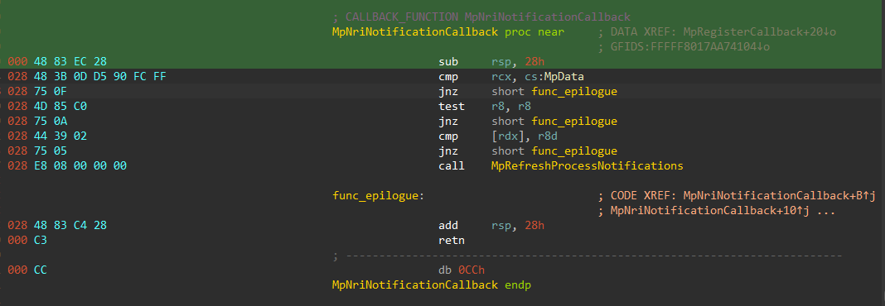
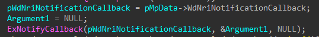

## WdNriNotificationCallback

### Description

The callback object can be created in 2 places: `WdFilter.sys` and `WdNisDrv.sys`. But a callback function is registered only in `WdFilter.sys`, last time we checked the callback was named `MpNriNotificationCallback`. The callback in itself isn't very interesting and in essence is just a wrapper around `MpRefreshProcessNotifications`, which we already sketched in [WdProcessNotificationCallback](../WdProcessNotificationCallback). Callback's code is provided just as a future reference:

We observed that this callback object is notified from `WdNisDrv.sys` - `set_process_exceptions(PMP_DATA , PIRP *)`.

