## WdProcessNotificationCallback

### Description

`WdProcessNotificationCallback` callback object is "born" either from `WdFilter.sys` or `WdNisDrv.sys`. In both cases it is created by a wrapper function called `MpCreateCallback`.
But `WdFilter` is a bit special, because the callback object can be named `MpProcessNotificationCallback`(observe the difference of 2 characters in the prefix). This change of behavior
is controlled byte a `boolean` flag(exhausting his existence at offset `+0x6B1`) in `MpData` context structure maintained by the driver - `MpData`. If the value of the `boolean` flag is `1`, look
for `WdProcessNotificationCallback`...
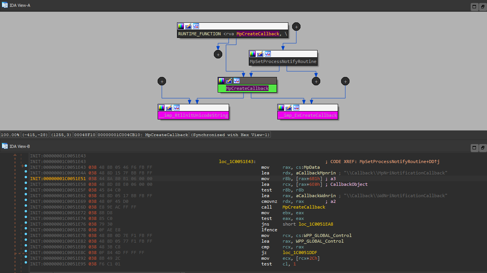

Unsurprisingly, the code path that ends in notifying this object goes through `WdFilter.sys` and last 4 stack frames, in case of process creation or termination, can be stamped as:

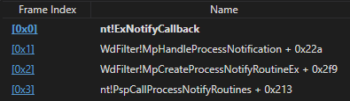

Before going further, it is necessary to know when our callback will receive a notification for the callback object we've registered. Extending the thought from above and observing that there are _5_
calls to `ExNotifyCallback` having their first argument `MpData + 0x6D8`, standing for `CallbackObject` parameter as presented in [MSDN](https://docs.microsoft.com/en-us/windows-hardware/drivers/ddi/wdm/nf-wdm-exnotifycallback), it is possible to affirm that the following operations are going to "disturb" our callback:
- **Process creation**
- **Process termination**, both called from `MpHandleProcessNotification`
- **Refresh process notifications**, called from `MpRefreshProcessNotification`
- **Set trusted process**, called from `MpSetTrustedProcess`
- **Set untrusted process**, called from `MpSetUntrustedProcess`

In order to understand what data our callback will obtain, we have to peel the onion level by level. Let's start with process creation and termination. At the outer level, an easy target, we find `MpCreateProcessNotifyRoutineEx` which receives 3 arguments.
For convenience, the [prototype](https://docs.microsoft.com/en-us/windows-hardware/drivers/ddi/ntddk/nc-ntddk-pcreate_process_notify_routine_ex) of this function is:
```C
void PcreateProcessNotifyRoutineEx(
  PEPROCESS                 Process,
  HANDLE                    ProcessId,
  PPS_CREATE_NOTIFY_INFO    CreateInfo
)
```
The last parameter is a pointer to `PS_CREATE_NOTIFY_INFO` structure, created inside `PspCallProcessNotifyRoutines`, having the following [definition](https://docs.microsoft.com/en-us/windows-hardware/drivers/ddi/ntddk/ns-ntddk-_ps_create_notify_info):
```C
typedef struct _PS_CREATE_NOTIFY_INFO {
  SIZE_T              Size;
  union {
    ULONG Flags;
    struct {
      ULONG FileOpenNameAvailable : 1;
      ULONG IsSubsystemProcess : 1;
      ULONG Reserved : 30;
    };
  };
  HANDLE              ParentProcessId;
  CLIENT_ID           CreatingThreadId;
  struct _FILE_OBJECT *FileObject;
  PCUNICODE_STRING    ImageFileName;
  PCUNICODE_STRING    CommandLine;
  NTSTATUS            CreationStatus;
} PS_CREATE_NOTIFY_INFO, *PPS_CREATE_NOTIFY_INFO;
```

Skipping some details in `MpCreateProcessNotifyRoutineEx`, our attention can be directed to the call into `MpHandleProcessNotification`. Here's an attempt of outlining a prototype for this routine:
```C
VOID MpHandleProcessNotification(PEPROCESS          Process,
                                 HANDLE             PPid,
                                 HANDLE             Pid,
                                 BOOL               Create,
                                 BOOL               IsTransactedFileOperation,
                                 PUNICODE_STRING    ImageFileName,
                                 PUNICODE_STRING    CommandLine,
                                 PVOID              pOutput);
```

Fourth parameter, `Create`, when `TRUE` indicates that `WdFilter` has to handle _process creation_ and _process termination_ for the opposite case.
Before sending a notification for _process creation_, a couple of other interesting actions are taken. Let's start with:
```C
NTSTATUS MpCreateProcessContext(HANDLE              Pid,
                                LONGLONG            ProcessCreationTime,
                                PCUNICODE_STRING    *ImageFileName,
                                MP_PROCESS_CONTEXT  **ProcessContextListEntry)
```

The purpose of `MpCreateProcessContext` is clear from its name, but our interest is what is the definition of a process context. First things first, every created process that reaches this code path
will have a process context inside `WdFilter`. There's a global structure, whose structure definition we named `MP_PROCESS_TABLE`, pointed by `MpProcessTable` global variable that keeps
record of what processes were created. Currently, based on the code that initializes this structure - `MpInitializeProcessTable`, `WdFilter` keeps track of maximum _128_ processes. Some of this structure's
fields we hadn't observed being used, thus we consider them to be reserved or simply unused currently( or we made some mistake, we hope not). Our definition for it is:

```C
typedef struct _MP_PROCESS_TABLE
{
  DWORD64               Magic; // 0x1C0DA13, 0x1C0 is the size of the structure, so the first field can be the SizeOfStruct, but...
  ERESOURCE             MpProcessTableEresource;
  PVOID                 Reserved1;
  PVOID                 Reserved2;
  NPAGED_LOOKASIDE_LIST PagedLookasideList1;
  NPAGED_LOOKASIDE_LIST PagedLookasideList2;
  PLIST_ENTRY           ProcessContexts;
  KEVENT                MpProcessTableKevent;
  __int64               AddendTrustedProcess;
  __int64               AddendUntrustedProcess;
  __int64               Addend3;
  PVOID                 Reserved3;
} MP_PROCESS_TABLE, *PMP_PROCESS_TABLE;
```

Every new process gets a "seat" inside the list named `ProcessContexts`. Every member actually is part of another structure, which we named(surprise, surprise) - `MP_PROCESS_CONTEXT`. The fields of
each process context are initialized inside `MpCreateProcessContext`. Unfortunately, as before, some fields remain a mystery to us, for some of them the semantics isn't well understood and for others no trace of usage. Living those as reserved, the definition looks like so:

```C
typedef struct _MP_PROCESS_CONTEXT
{
  DWORD64                           Magic; // 0xC0DA0F; previous version of WdFilter used 0xC8DA0F, 8 bytes more and it was containing the field that is commented `FileNameInformation`
  LIST_ENTRY                        ListEntry;
  HANDLE                            Pid;
  LONGLONG                          ProcessCreationTime;
  PUNICODE_STRING                   ProcessCommandLine;
  INT32                             Addend;
  DWORD32                           ProcessFlags;
  DWORD32                           Reserved1;
  DWORD32                           Reserved2;
  INT64                             Reserved3;
  INT64                             Reserved4;
  PMP_DOC_OPEN_RULE                 MpDocOpenRule;
  PFLT_COMPLETED_ASYNC_IO_CALLBACK  PfltCompletedAsyncIoCallback;
  INT32                             Addend2;
  INT32                             Addend3;
  INT64                             Addend4;
  INT64                             Reserved5;
  SUBSYSTEM_INFORMATION_TYPE        ProcessSubsystemInfo;
  PUNICODE_STRING                   ProcessName;
  _m128                             Reserved6;
  _m128                             Reserved7;
  _m128                             Reserved8;
  _PS_PROTECTION                    ProcessProtectionInfo;
  INT32                             Reserved9; // initialized to 0
  // PFLT_FILE_NAME_INFORMATION        FileNameInformation;
} MP_PROCESS_CONTEXT, *PMP_PROCESS_CONTEXT;
```

An interesting member residing in the above definition is `MpDocOpenRule`. There are a set of functions that contain the pattern `DocOpenRule`, into which we didn't dig, but it was easy to understand
that the data structures follow the same architectural pattern as before, a global struct in this case named `MpBmDocOpenRules` containing a linked list where members are stored. The definitions that we derived are:

```C
typedef struct _MP_DOC_OPEN_RULES
{
  DWORD64               Magic; // 0x100DA14
  PLIST_ENTRY           ListEntryHead;
  ERESOURCE             MpDocEresource;
  PVOID                 Reserved;
  PAGED_LOOKASIDE_LIST  MpDocLookasideList;
} MP_DOC_OPEN_RULES, *PMP_DOC_OPEN_RULES;
```

```C
typedef struct _MP_DOC_OPEN_RULE
{
  DWORD32       Magic; // 0x228DA15
  INT32         Addend;
  PLIST_ENTRY   ListEntryHead;
  WCHAR         pBuffer[261];
  PVOID         PagedPoolBuffer;
} MP_DOC_OPEN_RULE, *PMP_DOC_OPEN_RULE;
```
For example the above buffer, `pBuffer` can contain data like:
```
0: kd> db ffff9588`dfd99dd0
ffff9588`dfd99dd0  41 00 63 00 72 00 6f 00-52 00 64 00 33 00 32 00  A.c.r.o.R.d.3.2.
ffff9588`dfd99de0  2e 00 65 00 78 00 65 00-00 00 00 00 00 00 00 00  ..e.x.e.........
```
And `PagedPoolBuffer`:
```
0: kd> db ffff9588`dfdd8eaa La
ffff9588`dfdd8eaa  70 00 64 00 66 00 00 00-00 00                    p.d.f.....
```

Seems like a _surjective function_ mapping a tool to a file extension such that `WD` can check if a `pdf` is opened with an expected tool? Not sure. They deserve some more research(for another time).

Ok, next are following a couple of other interesting function calls, let's welcome - `MpSetProcessDocOpenRule`, `MpSetProcessPreScanHook`, `MpSetProcessExempt`, `MpSetProcessHardening` and `MpSetProcessHardeningExclusion`.
Just from their names we see how appealing this functions are, but for the sake of keeping these notes as short as possible(and easy to understand) and not reversing the whole driver we're not going to dig into them now.
The next station(/call) is our destination, it's where we're meeting - [ExNotifyCallback](https://docs.microsoft.com/en-us/windows-hardware/drivers/ddi/wdm/nf-wdm-exnotifycallback). We already know what is going to be the first argument, the third one is `NULL` for both cases(_process creation_ and _process termination_). We walked through to see what is going to be served for `Argument1`(second parameter). To understand it easier let's see a snippet from the code:

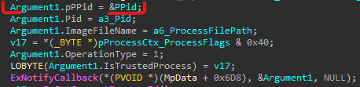

So this is the structure filled with sweets that we're going to get a pointer to. In a rush we quickly sputter a definition:
```C
typedef struct _WD_PS_NOTIFY_INFO
{
  HANDLE            Pid;
  PHANDLE           pPPid;
  PUNICODE_STRING   ImageFileName;
  DWORD32           OperationType;
  BOOLEAN           IsTrustedProcess;
} WD_PS_NOTIFY_INFO, *PWD_PS_NOTIFY_INFO;
```

But the sparkling thing in all that structure seems to be it's second field(highlighted in the image). And we think that's because we have a pointer to _parent pid_ instead of having it's value. Moreover that pointer is to a stack location. Why is that so?

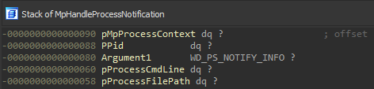

So, in our opinion that second field is a pointer because this way we can get access to more information abstracted by the pointer to `MP_PROCESS_CONTEXT`. An updated structure definition and image:

```C
typedef struct _WD_PS_NOTIFY_INFO_EX
{
    PMP_PROCESS_CONTEXT pMpProcessContext;
    HANDLE              PPid;
    WD_PS_NOTIFY_INFO   WdPsNotifyInfo;
} WD_PS_NOTIFY_INFO_EX, *PWD_PS_NOTIFY_INFO_EX;
```
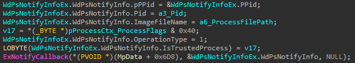

Until now we were in the realm of _process creation_. For _process termination_ there's not much to say, only two fields carrying useful information, `Pid` and `OperationType`.

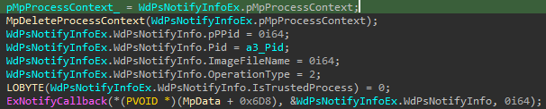

When it comes to _set trusted process_ and _set untrusted process_ there's no much difference between them, both can be identified by `OperationType` being equal to _3_:
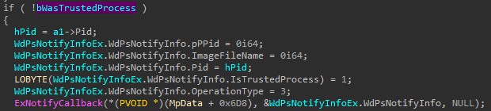
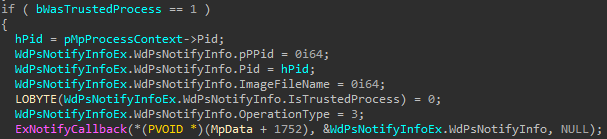

Both changes in state can be triggered from `MpUpdateProcessesWithExclusions` or `MpSetProcessInfoByContext`. State of being _trusted_ or _untrusted_ can be also obtained from `MP_PROCESS_CONTEXT.ProcessFlags` by checking _7th_ bit. For example this is how it is checked inside `MpSetUntrustedProcess`:
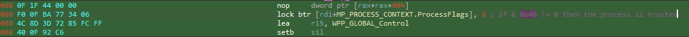

At last, _refresh process notifications_ in essence is an iteration over the list of process contexts with the purpose of sending a notification regarding fields that are also present in _set trusted process_ and _set untrusted process_. It is being called from `MpNriNotificationCallback`.

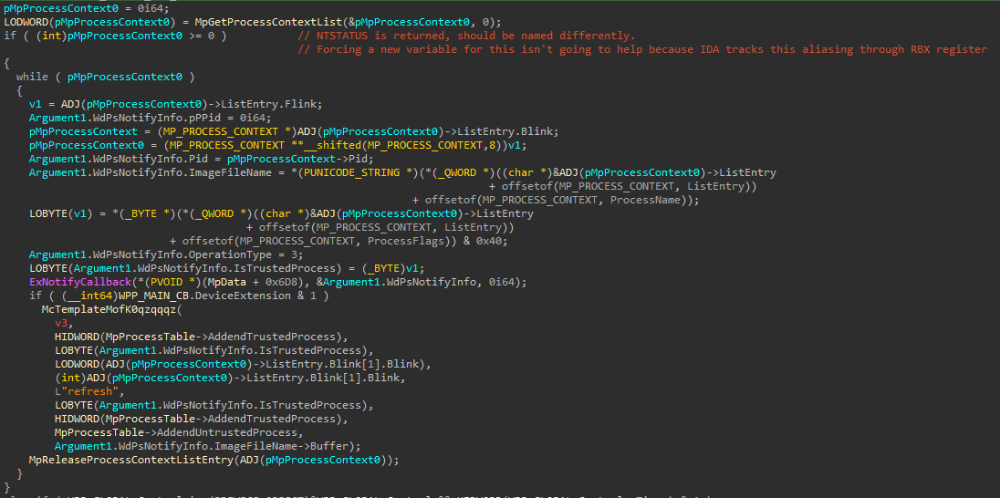
(_SOTSOG_)

### POC

[WdProcessNotificationCallback](WdProcessNotificationCallback) is a simple proof of concept driver to show how this feature can be used.

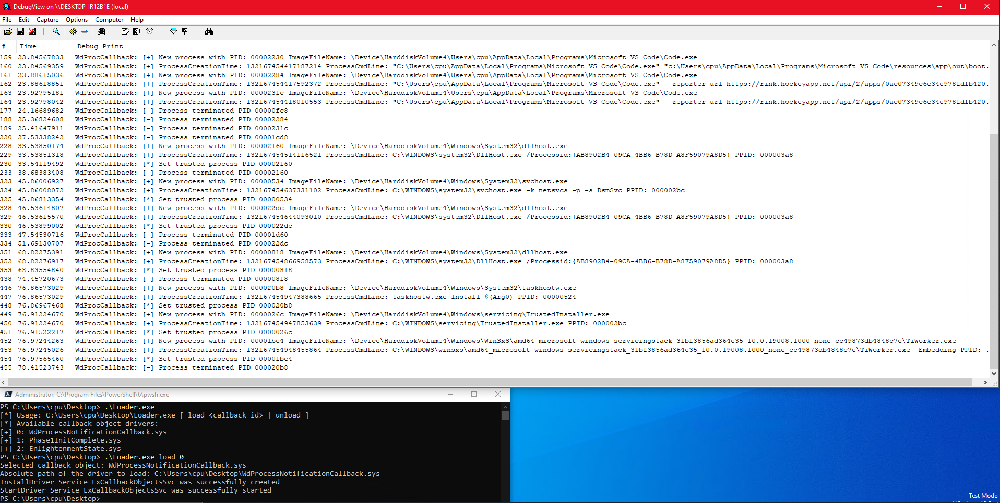

**To our knowledge, the only registered callback function for this callback object belongs to `WdNisDrv.sys` and is named `process_notification_callback`**

## EOF